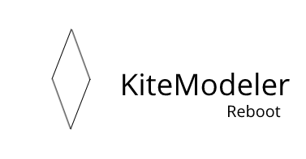
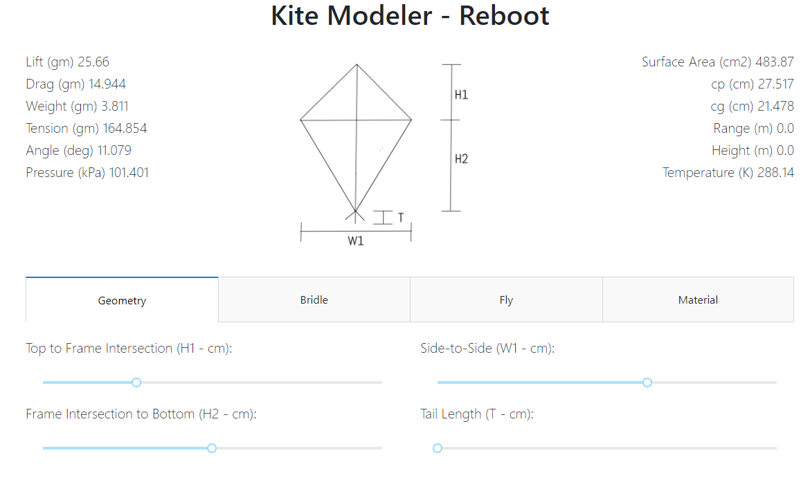

# KiteModeler - Reboot




This repository contains the open-source back-end and front-end
code for KiteModeler-Reboot, which is a modern
version of [KiteModeler](https://www.grc.nasa.gov/WWW/K-12/airplane/kiteprog.html) from NASA Glenn.


The entire code has been written in Python (using [Dash](https://plot.ly/dash/) for the front-end)

## How to install and execute
* Using pip, run
```
pip install -r requirements.txt
```

* Run the code using
```
python index.py
```

## Sample



## Whom to contact?

Please direct your queries to [gpavanb1](http://github.com/gpavanb1)
for any questions.
